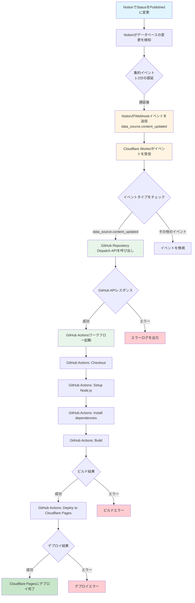

# 自動デプロイ設定ガイド

Notion でブログ記事の Status を「Published」に変更すると、自動的に Cloudflare Pages にデプロイされる仕組みを設定します。

## ワークフロー遷移図



## 各コンポーネントの役割

### 1. Notion

- ブログデータベースの Status プロパティを管理
- データベースの変更を検知して Webhook イベントを送信
- **重要**: `data_source.content_updated`は集約イベントのため、1-2 分の遅延がある可能性があります

### 2. Cloudflare Worker

- Notion からの Webhook イベントを受信
- イベントタイプが`data_source.content_updated`の場合のみ処理
- GitHub Repository Dispatch API を呼び出して GitHub Actions をトリガー

### 3. GitHub Actions

- Worker からのトリガーを受信（`repository_dispatch`イベント）
- Notion API からブログデータを取得
- Next.js アプリケーションをビルド
- Cloudflare Pages にデプロイ

## 必要な認証情報の取得

### 1. GitHub Personal Access Token (PAT)

1. GitHub にログイン
2. Settings → Developer settings → Personal access tokens → Tokens (classic)
3. 「Generate new token (classic)」をクリック
4. 設定:
   - Note: `Notion Webhook Worker`
   - Expiration: 適切な期間を選択（推奨: 90 days または No expiration）
   - Scopes: `repo` にチェック（リポジトリへの書き込み権限）
5. 「Generate token」をクリック
6. **トークンをコピーして安全に保管**（一度しか表示されません）

### 2. Cloudflare API Token

1. Cloudflare Dashboard にログイン
2. My Profile → API Tokens
3. 「Create Token」をクリック
4. 「Edit Cloudflare Workers」テンプレートを選択、またはカスタムトークンを作成:
   - Permissions:
     - Account → Cloudflare Pages → Edit
   - Account Resources:
     - Include → あなたのアカウントを選択
5. 「Continue to summary」→ 「Create Token」
6. **トークンをコピーして安全に保管**
7. **Account ID も確認**（Dashboard URL の `/accounts/` の後ろの文字列）

## GitHub Secrets の設定

1. GitHub リポジトリ `tokechan/tokechan-blog` にアクセス
2. Settings → Secrets and variables → Actions
3. 「New repository secret」をクリックして以下を追加:

| Name                    | Value                                                |
| ----------------------- | ---------------------------------------------------- |
| `NOTION_TOKEN`          | `ntn_i9509198130jzNTadkhjeIyVImS9SaIkjejsZQhpX847UU` |
| `NOTION_DATABASE_ID`    | `1d9236cad93280ccb990cb26df206c49`                   |
| `CLOUDFLARE_API_TOKEN`  | Phase 1 で取得した Cloudflare API Token              |
| `CLOUDFLARE_ACCOUNT_ID` | Phase 1 で取得した Cloudflare Account ID             |

## Cloudflare Worker のデプロイ

```bash
cd notion-webhook-worker
npm install
npx wrangler secret put GITHUB_TOKEN
# GitHub PATを入力
npm run deploy
```

デプロイ後、Worker URL をメモしてください（例: `https://notion-webhook-worker.your-account.workers.dev`）

## Notion Webhook の設定

1. [Notion My Integrations](https://www.notion.so/my-integrations) にアクセス
2. `blog-integraton2` を選択
3. 「Webhook」タブを開く
4. 「Add subscription」をクリック
5. 設定:
   - **Endpoint URL**: Worker URL（上記で取得）
   - **Events**: `data_source.content_updated` にチェック（データソースカテゴリを選択）
   - **API version**: `2025-09-03`（`data_source.*`イベントはこのバージョンでのみサポート）
6. 「Save」をクリック

## テスト

### 手動テスト

1. GitHub リポジトリ → Actions タブ
2. 「Deploy on Notion Update」ワークフローを選択
3. 「Run workflow」をクリック
4. ビルドとデプロイが成功するか確認

### Webhook 経由のテスト

1. Notion でブログ記事を編集
2. Status を「Published」に変更
3. Cloudflare Worker のログを確認:
   ```bash
   cd notion-webhook-worker
   npx wrangler tail
   ```
4. GitHub Actions のログを確認（リポジトリ → Actions）
5. Cloudflare Pages にデプロイが完了するか確認

## トラブルシューティング

### Worker が Webhook を受信しない

- Notion Webhook の設定を確認
- Worker URL が正しいか確認
- Worker のログを確認: `npx wrangler tail`

### GitHub Actions が起動しない

- GitHub PAT が正しく設定されているか確認
- Worker のログで GitHub API エラーがないか確認
- GitHub Secrets が正しく設定されているか確認

### ビルドエラー

- GitHub Secrets の `NOTION_TOKEN` と `NOTION_DATABASE_ID` が正しいか確認
- ローカルで `npm run build` が成功するか確認

### デプロイエラー

- Cloudflare API Token と Account ID が正しいか確認
- Cloudflare Pages プロジェクト名が `tokechan-blog` か確認
